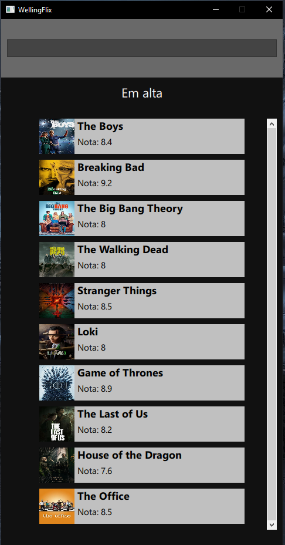
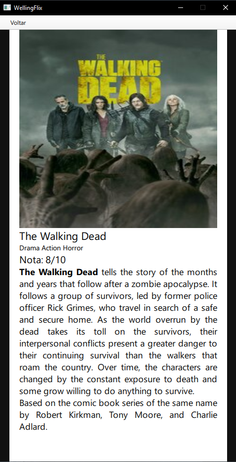
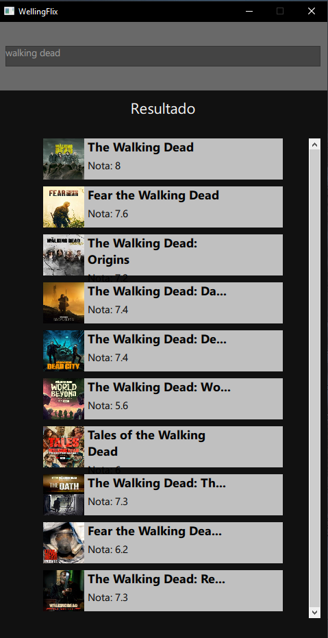

  

Desafio Stone
========================
* Pré-requisitos
* Importação do projeto no Qt Creator
* Build do projeto no Qt Creator

Pré-requisitos
-------------------
* Qt Creator instalado
* Arquivos do windows de compilação para versão 6.4 do QML
* Git instalado no terminal - comando para validar `git --version`

Importação do projeto
---------------------

Ao abrir o Qt Creator, clicar em "create project", após isso irá abrir uma janela com a opção de importar via repositório Git o projeto, adicionar o link desse repositório.

Build do projeto
----------------------

Após a importação do projeto, apertar a tecla F5 ou ir pela IDE e clicar na pasta do projeto, com o mouse e o clique do botão direito clicar em RUN

Código
---------------------

* `Main.cpp` - responsável pela inicialização do Qt que utiliza QML/C++

* `SeriesSearch.cpp` - responsável pela comunicação com a API da TVMAZE e população dos Models, como as séries em alta e a opção de buscar por uma série desejada

* `Main.qml` - Tela inicial do projeto onde tem o componente de StackView que carrega as séries em alta

* `HighLights.qml` - Tela onde é carregado as séries em alta onde é passado na ListView por meio do delegate as informações do model `SeriesSearch.h`

* `SerieInfo.qml` - Tela onde é carregado as informações da série selecionada: nome da série, imagem, resumo, gêneros e nota.

Implementações futuras:
-------------------

* Separação em mvc;

* Adicionar os arquivos *.ui.qml para separar a estilização das regras de tela.

Prints do App
-------------------

  

  

  

